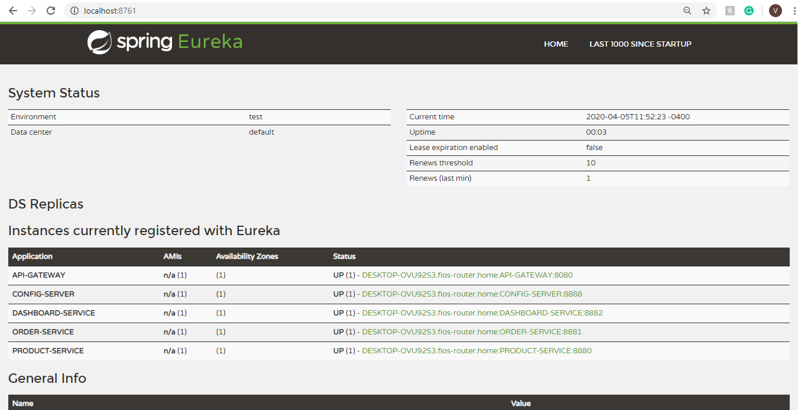
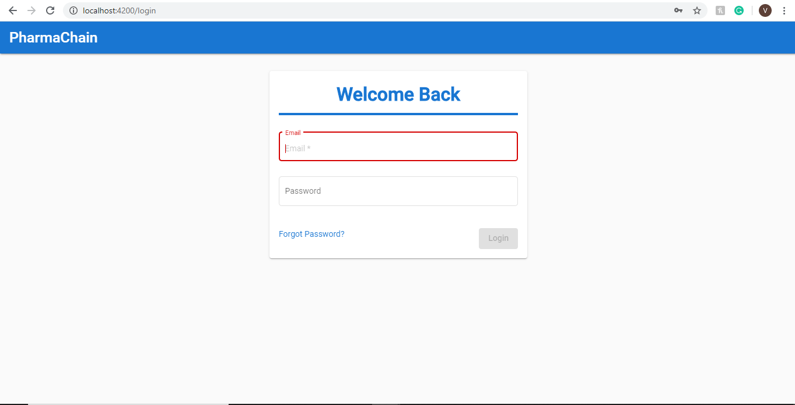
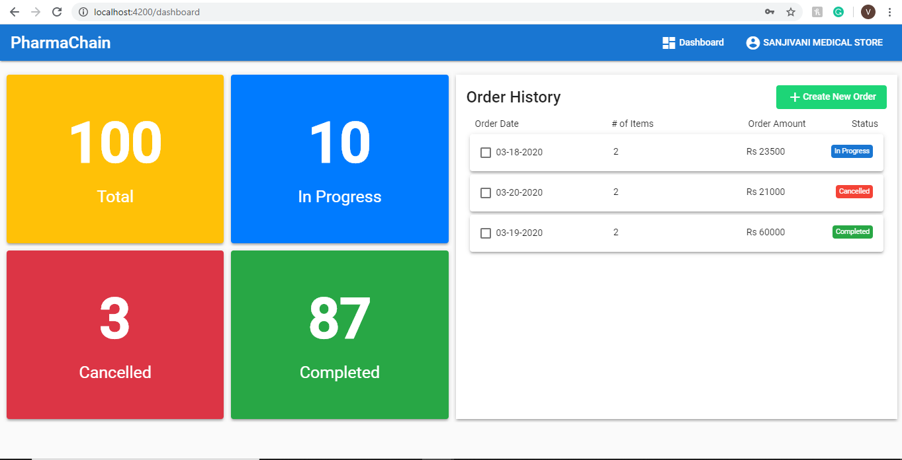
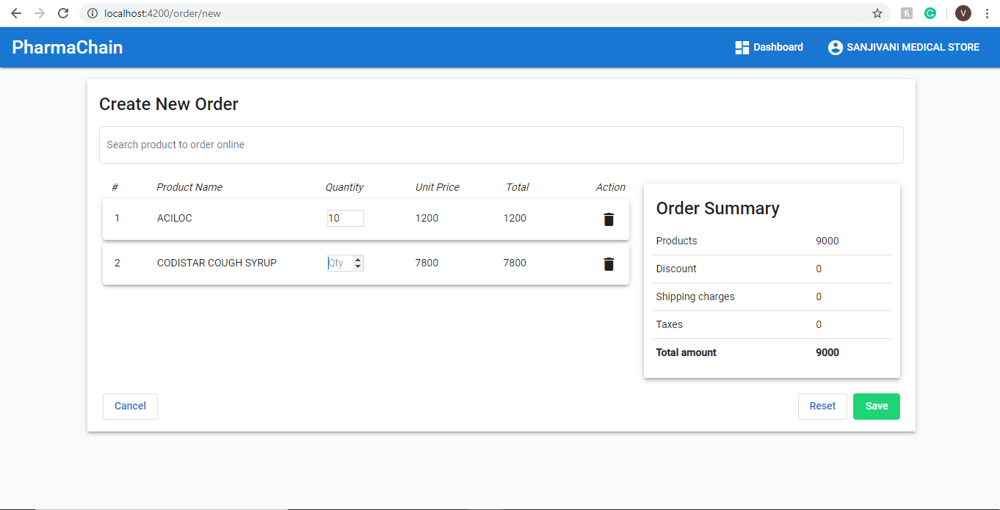

# PharmaChain
I am working on this project to solve the problems I have seen in the pharmacy supply chain. My brother owns a retail pharmacy in India. Today, we order everything online, but they are still calling the wholesale suppliers and giving them orders by phone. Many startups are trying to solve this problem and some of them have solved it, but not completely and there are still many problems that can be solved only by doing this end to end.

There are 2 goals of this project -
1) Built all in one Pharmacy supply chain platform
2) Learn and apply new skills like building scalable system, Data Science and Machine learning tools, Docker, AWS etc.

I will be using Java/Spring/Netflix OSS to built a microservices backend. Angular to built a component based front end.

**I am currently working on this project in my freetime. Some of feature data is mocked**

### Technical Architecture

### Run Application
1. Install Java, Maven, MongoDB  
2. Create a 'pharmachain' database in MongoDB  
3. Clone this repository  
4. Run startup.bat  
5. Open - localhost:4200

### Eureka Server

### Login

### Dashboard

### Create New Order
